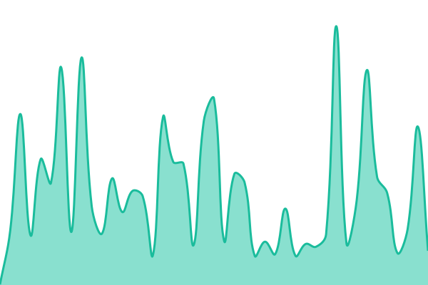
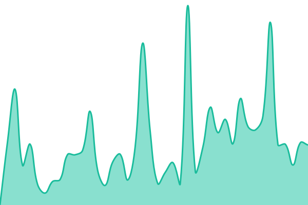
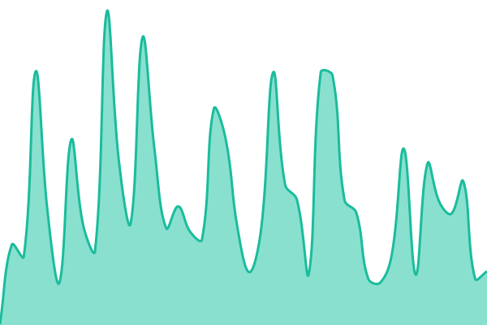

# [📈 Live Status](https://uptime.meali.top): <!--live status--> **🟩 All systems operational**

This repository contains the open-source uptime monitor and status page for [Ukncat](https://meali.top), powered by [Upptime](https://github.com/upptime/upptime).

With [Upptime](https://upptime.js.org), you can get your own unlimited and free uptime monitor and status page, powered entirely by a GitHub repository. We use [Issues](https://github.com/wumingshiali/uptime/issues) as incident reports, [Actions](https://github.com/wumingshiali/uptime/actions) as uptime monitors, and [Pages](https://uptime.meali.top) for the status page.

<!--start: status pages-->
<!-- This summary is generated by Upptime (https://github.com/upptime/upptime) -->
<!-- Do not edit this manually, your changes will be overwritten -->
<!-- prettier-ignore -->
| URL | Status | History | Response Time | Uptime |
| --- | ------ | ------- | ------------- | ------ |
|  [个人网站稳定版](https://meali.top) | 🟩 Up | [个人网站稳定版.yml](https://github.com/wumingshiali/uptime/commits/HEAD/history/个人网站稳定版.yml) | 

 188ms
     
 | 

<a href="https://uptime.meali.top/history/个人网站稳定版">100.00%</a>
    

|  [个人网站开发版](https://dev.meali.top) | 🟩 Up | [个人网站开发版.yml](https://github.com/wumingshiali/uptime/commits/HEAD/history/个人网站开发版.yml) | 

 208ms
     
 | 

<a href="https://uptime.meali.top/history/个人网站开发版">100.00%</a>
    

|  [博客](https://blog.meali.top) | 🟩 Up | [博客.yml](https://github.com/wumingshiali/uptime/commits/HEAD/history/博客.yml) | 

 450ms
     
 | 

<a href="https://uptime.meali.top/history/博客">100.00%</a>
    

|  [通缉令生成器](https://tjl.meali.top) | 🟩 Up | [通缉令生成器.yml](https://github.com/wumingshiali/uptime/commits/HEAD/history/通缉令生成器.yml) | 

 817ms
     
 | 

<a href="https://uptime.meali.top/history/通缉令生成器">99.61%</a>
    

|  [文字渲染器](https://tg.meali.top) | 🟩 Up | [文字渲染器.yml](https://github.com/wumingshiali/uptime/commits/HEAD/history/文字渲染器.yml) | 

 410ms
     
 | 

<a href="https://uptime.meali.top/history/文字渲染器">100.00%</a>
    

<!--end: status pages-->

[**Visit our status website →**](https://uptime.meali.top)

## 📄 License

- Powered by: [Upptime](https://github.com/upptime/upptime)
- Code: [MIT](./LICENSE) © [Anand Chowdhary](https://anandchowdhary.com), supported by [Pabio](https://pabio.com)
- Data in the `./history` directory: [Open Database License](https://opendatacommons.org/licenses/odbl/1-0/)
